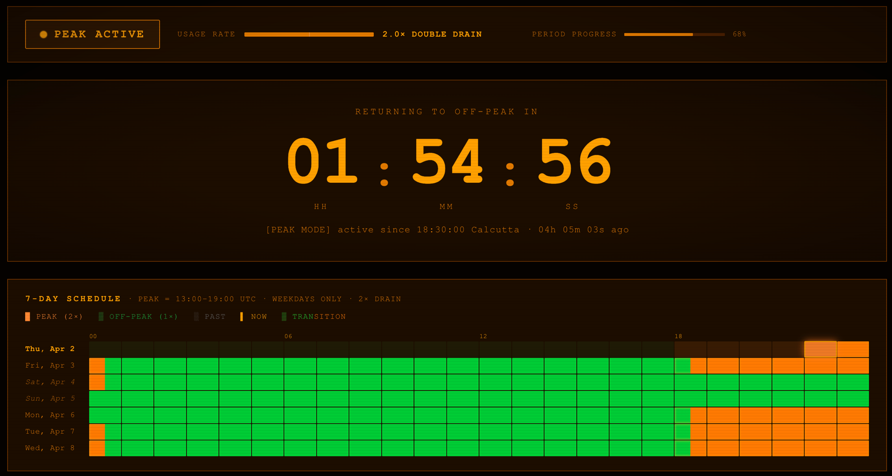

# Claude Peak Monitor

A terminal-style real-time monitor for Claude's peak usage hours — built with React, TypeScript, and Vite.

**Live:** https://cclock.shashwat.io



## What it does

Claude operates on a tiered usage system where requests during peak hours count at **2× the rate** of off-peak hours.

**Peak hours:** 13:00–19:00 UTC, weekdays only

This tool shows you:
- Live countdown to the next peak/off-peak transition
- Your current usage rate (1× or 2×)
- A 7-day heatmap of peak vs off-peak hours in your local timezone
- Split-hour cells for timezones with half-hour/quarter-hour UTC offsets (e.g. IST, NPT)
- ET, UTC, and local time clocks
- Audio alerts on peak transitions
- Responsive layout for mobile

## Tech stack

- React 19 + TypeScript
- Vite 8
- Pure CSS (no UI library) — CRT/terminal aesthetic
- Web Audio API for transition chimes
- All peak logic in UTC to avoid DST edge cases

## Local development

```bash
pnpm install
pnpm dev
```

## Build

```bash
pnpm build
```

## Deploy

Pushes to `main` automatically deploy to GitHub Pages via the included workflow (`.github/workflows/deploy.yml`).

## License

MIT
